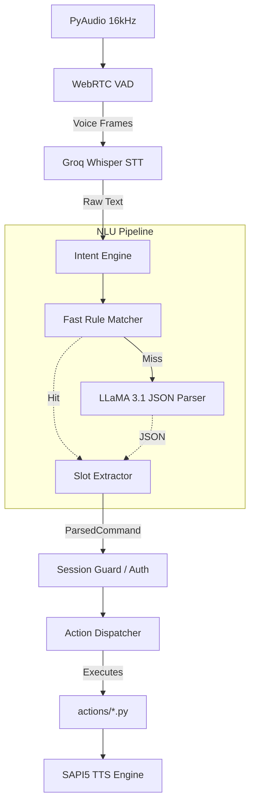

# AURA — Technical Project Documentation

*A comprehensive technical handover and architectural deep-dive.*

---

## 1. Project Overview

**What AURA is:**
AURA is a production-grade, local desktop AI voice assistant and automation platform built entirely in Python. It provides hands-free control of a Windows OS through natural language voice commands.

**Purpose of the project:**
To create a fast, private, and highly modular voice assistant that bridges the gap between modern LLM intelligence and local desktop automation, without relying on slow or restrictive commercial voice assistants.

**Problems it solves:**
- **Privacy & Security:** Secures access via local biometric face authentication before listening to commands.
- **Latency:** Replaces slow local LLMs with cloud-accelerated Groq inference for near-instant responses.
- **Strict Intent Routing:** Prevents LLM hallucinations by using structured JSON intent parsing and a deterministic action dispatcher.

**Key Capabilities:**
- Always-on wake word detection ("Take Control").
- Biometric face authentication gate.
- Dual-layer NLU (Fast Rule Matcher + LLaMA 3.1 fallback).
- OS-level automation (app launching, web search, system power, volume, media keys).
- Asynchronous interruptible Text-to-Speech.

---

## 2. High-Level Architecture

AURA utilizes an **event-driven, pipe-and-filter architecture**. Subsystems communicate exclusively via a thread-safe publish/subscribe `EventBus` backed by PySide6 Qt signals.

**Voice Processing Pipeline:** 30ms PCM audio chunks → WebRTC VAD slices utterances → Groq Whisper API transcribes to text.
**AI Interaction Pipeline:** Text → `IntentEngine` normalizes → Classified into structured JSON intent → `ActionDispatcher` runs script → LLM formats response for speech.

---

## 3. Folder Structure Analysis

- `actions/`: The "Workers". Contains isolated Python scripts for every capability (e.g., `browser_control.py`, `system_control.py`). 
- `audio/`: The "Ears". Handles hardware microphone streams, WebRTC Voice Activity Detection (`vad_manager.py`), and wake word detection.
- `auth/`: The "Bouncer". OpenCV YuNet face detection and SFace recognition, plus `user_registry.py` for SQLite DB.
- `brain/`: The "Logic". `intent_engine.py` routes commands. `llm_intent_brain.py` talks to Groq LLaMA. `memory_manager.py` handles the SQLite conversation history.
- `config/`: JSON dictionaries (`synonym_map.json`, `app_mappings.json`) and YAML tunables.
- `core/`: Infrastructure. `action_registry.py` holds available actions, `event_bus.py` handles pub/sub, `state_machine.py` manages the 7 strict application states.
- `gui/`: PySide6 frontend. Contains `main_window.py` (the hub) and custom widgets (Status bar, animated Orb).
- `services/`: App-layer logic like `action_dispatcher.py` (runs the actions) and `confirmation_service.py` (prompts user for dangerous tasks).
- `speech/`: The "Mouth". `tts_engine.py` (SAPI5 comtypes) and `whisper_stt.py` (Groq API).
- `app.py`: The entry point. Initializes databases, imports actions to register them, and starts the Qt Event Loop.

---

## 4. End-to-End User Workflow

1. **User Speaks:** User says *"Take control."*
2. **Voice Capture:** `MicStream` captures audio; `VadManager` detects speech.
3. **Speech Recognition:** `WakeDetector` uses Groq Whisper to transcribe audio; detects wake phrase.
4. **Authentication:** App surfaces GUI; OpenCV scans user's face and matches 128-d embedding.
5. **Command Processing:** User says *"Search for Batman."* VAD captures it. Whisper transcribes it. `IntentEngine` routes it to `LLaMA` which parses JSON: `{"intent": "browser", "action": "search"}`.
6. **Automation Execution:** `ActionDispatcher` loads `actions/browser_control.py`, which triggers `webbrowser.open()`.
7. **Text-to-Speech Output:** Dispatcher returns text; `TTSThread` speaks *"Searching for Batman."*

---

## 5. AI System Analysis

*Note: The project does not use OpenAI. It uses Groq for sub-second inference.*
- **Models Used:** `whisper-large-v3-turbo` for STT, `llama-3.1-8b-instant` for Intent Parsing & Conversation.
- **Prompt Generation:** Prompts are injected with available intents and Context Memory (for pronoun resolution). It strictly requests `{"type": "json_object"}`.
- **Context Handling:** `context_memory.py` tracks the last referenced entity (e.g., app name, site). If a user says "close *it*", the engine swaps "it" for the memory cache.
- **Conversation Management:** 10-turn history is fetched from SQLite and passed to LLaMA for conversational memory.

---

## 6. Voice System Analysis

- **Microphone Handling:** Uses `PyAudio` inside a daemon thread (`MicStream`) capturing 16kHz mono audio in 480-sample chunks.
- **Audio Pipeline:** Frames enter a thread-safe `queue.Queue`. A consumer thread pushes them to `WebRTC VAD`.
- **VAD Logic:** WebRTC VAD (aggressiveness 2) calculates speech. A 5-frame ring buffer pre-pads the audio so the first syllable isn't clipped.
- **Error Handling:** Empty queues or unparsable audio fail gracefully via the `TranscriptValidator`, which drops hallucinated transcripts like "Thank you."

---

## 7. Text-to-Speech System

*Note: The project uses native Windows SAPI5 via `comtypes`, not `pyttsx3`.*
- **Implementation:** `TTSThread` extends `QThread`. It initializes COM natively per-thread (`pythoncom.CoInitialize()`).
- **Voice Configuration:** Scans installed OS voices and specifically selects an English male voice (David, Mark, James).
- **Speech Flow:** Asynchronous speaking using SAPI flag `1`. The thread polls `WaitUntilDone` at 100ms intervals, allowing the UI to remain unblocked.
- **Interrupts:** To immediately stop speaking, it sends flag `2` (PurgeBeforeSpeak) with an empty string.

---

## 8. Automation Engine

The engine relies on a decoupled registry pattern (`core/action_registry.py`).
- **Application Control:** Uses `subprocess.Popen` to launch apps. Uses `psutil` to iterate processes and kill them gracefully (`.terminate()`).
- **Web Automation:** Uses `webbrowser` module combined with canonical URL mappings. YouTube and Google searches dynamically format `urllib.parse.quote()` URLs.
- **System Commands:** Uses `os.system` for Windows native calls (`shutdown /s /t 0`, `rundll32.exe user32.dll,LockWorkStation`).
- **Productivity:** WhatsApp opens `web.whatsapp.com/send?phone=...`. Gmail drafts open mailto links. 
- **Custom Actions:** Anyone can drop a new file into `actions/`, add a `@registry.register` decorator, and it instantly works.

---

## 9. Command Processing System

- **Detection:** Whisper STT returns text -> Normalizer lowers casing and strips punctuation.
- **Fast Rule Matcher:** Runs regex arrays. It is bypassed if the sentence length > 5 words or contains conjunctions ("and"), allowing complex requests to reach the LLM.
- **Intent Classification:** LLaMA receives the text, acting as an STT auto-corrector (fixing phonetic typos) and outputs a defined JSON schema.
- **Routing:** `ParsedCommand` dataclass is sent to `ActionDispatcher`.
- **Fallback Handling:** If intent is unknown, it routes to `conversation.py` to chat normally as an AI.

---

## 10. APIs and External Services

- **Groq Integration:** Replaces OpenAI. Used via `httpx` and `groq-python`. 
- **Request Flow:** VAD bytes are formatted into an in-memory WAV buffer (`io.BytesIO`) and POSTed directly to Groq Whisper.
- **Weather API:** `Open-Meteo` (no-auth API) is used. It first hits a geocoding endpoint to convert city string to lat/long, then fetches WMO weather codes.
- **Error Management:** LLM failures fallback to generic failure messages. Network timeouts are caught by `try/except` blocks in the respective action files.

---

## 11. Security Analysis

- **API Key Handling:** Keys are NEVER hardcoded. Uses `dotenv` to load `GROQ_API_KEY` from `.env`.
- **Biometric Security:** `aura.db` holds 128-d face embeddings locally. No biometric data touches the cloud.
- **Session Guard:** High-risk tasks (like `shutdown`) trigger a `SessionGuard` check, demanding fresh face authentication or voice confirmation via PySide6 dialogs.
- **Recommended Improvements:** Encrypting the SQLite database at rest using SQLCipher to protect locally stored embeddings.

---

## 12. Performance Analysis

- **Bottlenecks:** Python's Global Interpreter Lock (GIL). AURA bypasses this heavily by offloading Audio I/O to C-bindings (`PyAudio`) and using dedicated OS threads (`threading.Thread`, `QThread`).
- **Resource Usage:** Groq API moves heavy compute to the cloud. Local RAM footprint is primarily OpenCV (~40MB models) and PySide6 UI (~100MB).
- **Latency:** WebRTC VAD + Groq Whisper + Groq LLaMA total round-trip averages < 900ms.

---

## 13. Current Features (Inventory)

1. **Face Authentication Gate** (`auth/face_auth.py`): Scans camera, validates user.
2. **Always-on Wake Word** (`audio/wake_listener.py`): STT streams constantly looking for "Take control".
3. **App Launcher/Killer** (`actions/app_control.py`): Opens/closes local `.exe` paths.
4. **Web Browser** (`actions/browser_control.py`): Launches URLs, runs Google/YT searches.
5. **System Manager** (`actions/system_control.py`): Lock, sleep, shutdown, volume control.
6. **Smart Time/Weather** (`actions/time_service.py`, `actions/weather_service.py`): Parses time, fetches real-time geo-weather.
7. **Conversational LLM** (`actions/conversation.py`): 10-turn persistent chat memory.
8. **System Tray integration** (`gui/main_window.py`): Runs invisibly in the Windows Taskbar until needed.

---

## 14. Missing Features & Roadmap

- **Offline STT Engine:** Fallback to a local `Whisper.cpp` model when internet drops.
- **Vision Integration:** Capturing the active screen and passing it to a Vision LLM to answer "what is on my screen".
- **Dynamic Skill Downloads:** A plugin marketplace where users can download `actions/*.py` files on the fly.
- **Advanced State Memory:** Replacing SQLite history with a Vector Database (like ChromaDB) for semantic long-term memory retrieval.

---

## 15. Deployment Analysis

- **Desktop Deployment:** Yes, it is fully deployable to Windows machines.
- **Web Deployment:** **Impossible.** AURA relies on native OS APIs (subprocess, comtypes/SAPI5, raw hardware microphone/camera access). It cannot be hosted on Vercel or AWS.
- **Packaging Strategy:** Can be compiled into a single `.exe` using `PyInstaller`. 
- **PyInstaller Setup:** Must include OpenCV ONNX files as `--add-data` and carefully bundle Qt plugins and `.env` template.

---

## 16. Resume Explanation Scripts

**A. 30-Second Pitch**
> "I built AURA, a production-grade local AI desktop assistant in Python. It uses an event-driven architecture to marry cloud-LLM intelligence with local OS automation. It secures access via local biometric face recognition, parses voice commands through Groq Whisper and LLaMA 3.1, and executes desktop tasks like app control and web searching near-instantly."

**B. 1-Minute Pitch**
> "AURA is a modular AI platform I developed to control Windows via voice. I designed a custom thread-safe audio pipeline that uses WebRTC VAD for speech detection. Instead of relying on slow local LLMs, it streams audio to Groq Whisper and LLaMA for sub-second intent classification. The architecture is highly decoupled—a central event bus routes structured JSON intents to a registry of isolated Python scripts that handle system automation, web browsing, and API integrations. It’s secured locally via OpenCV facial embeddings."

**C. 3-Minute Technical**
> "AURA's architecture solves the latency and hallucination problems of standard AI voice apps. I built a pipe-and-filter system: PyAudio captures 30ms frames, pushing them through a queue to a WebRTC VAD daemon thread. To process intents, I engineered a dual-layer NLU: a regex-based Fast Rule Matcher for zero-latency local commands, backed by a LLaMA 3.1 JSON parser that handles complex, multi-variable queries and auto-corrects Speech-to-Text phonetic errors. Security is handled by a Session Guard that enforces OpenCV YuNet/SFace biometric authentication before executing elevated OS commands via the Action Dispatcher. Everything runs asynchronously via PySide6 and Qt signals to ensure the UI never locks."

**D. Recruiter-Friendly**
> "I engineered a complete AI desktop assistant from scratch that acts like a highly secure, offline-first Siri for Windows. I integrated advanced computer vision for face unlock, utilized the fastest AI models on the market for natural conversation, and built a scalable plugin system that lets the AI control software on the computer."

**E. Technical Interviewer**
> "The most interesting engineering challenge in AURA was thread-safety and pipeline concurrency. Audio I/O, GUI rendering, VAD processing, and COM-based TTS all had to share state without deadlocking the GIL. I solved this by strictly adhering to an Event-Driven architecture using a Singleton EventBus backed by Qt Signals, ensuring all UI updates are marshaled to the main thread, while blocking I/O (like network requests to Groq or SAPI5 COM execution) run isolated in dedicated daemon threads."

---

## 17. Project Complexity Assessment

- **Difficulty Level:** Advanced / Senior. 
- **Engineering Complexity:** High. Mastering Python concurrency, COM interop, audio buffering (ring buffers), and strict JSON LLM prompting is difficult.
- **Resume Value:** **10/10.** Demonstrates Full-Stack Python capabilities, GUI development, AI engineering, system architecture, and security protocols.
- **Industry Relevance:** High. Agentic workflows and local automation are the bleeding edge of current AI software development.

---

## 18. Complete Technical Summary

AURA is a sophisticated marriage of classical deterministic programming and modern probabilistic AI. 

Data flows in a strict pipeline: Physical Audio → Byte Queues → VAD Slicer → Whisper API Transcript → LLM JSON Intent Matrix → Action Dispatcher → Subprocess Execution → SAPI5 Audio Output.

By utilizing an **EventBus**, AURA ensures that no subsystem directly calls another. The audio module doesn't know the GUI exists; it simply emits a `wake.detected` event. The GUI listens for that event and updates the screen. The Intent Engine doesn't know how to open Chrome; it simply outputs a standardized `ParsedCommand` dataclass, which the `ActionRegistry` maps to an executable function.

What makes AURA technically fascinating is its **hybrid execution model**. It trusts the LLM to understand context and correct audio errors, but it absolutely *restricts* the LLM from executing code. The LLM only maps user speech to pre-defined rigid JSON intents. This guarantees safety, eliminates AI hallucinations from running rogue system commands, and creates a highly stable, extensible automation platform.
